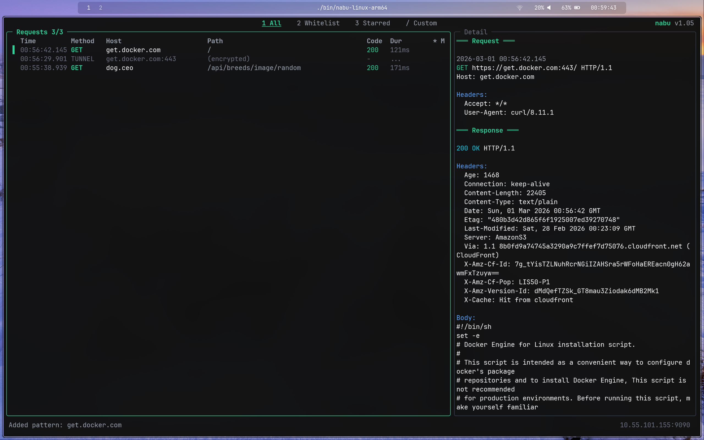

# proxy-tui

An HTTP/HTTPS debugging proxy with a terminal UI. Intercept, inspect, and manipulate HTTP traffic in real-time through a keyboard-driven interface with vim-style navigation.

Built with Go using [goproxy](https://github.com/elazarl/goproxy) for MITM interception and [tview](https://github.com/rivo/tview) for the terminal interface.



## Features

- **Conditional HTTPS interception** — only MITM whitelisted hosts, tunnel everything else
- **Map Local** — serve mock responses from local files
- **Map Remote** — transparently redirect requests to different servers
- **Real-time flow capture** — view requests and responses as they happen
- **Pause / Resume** — bypass all proxying with a single key, HAR import still works while paused
- **Star flows** — bookmark interesting flows and filter to show only starred ones
- **Export / Import** — export flows as HAR or cURL, import HAR files with a file picker
- **Alerts** — configurable alerts for 5xx responses and high latency
- **Multi-instance** — secondary viewers connect to a running proxy via IPC
- **Persistent configuration** — whitelist and mapping rules saved as JSONC
- **CLI management** — add, list, and remove rules from the command line

## Install

```bash
go build -o proxy-tui ./cmd/proxy-tui
```

## Usage

```bash
# Start with defaults (0.0.0.0:9090)
./proxy-tui

# Custom port and bind address
./proxy-tui --port 8080 --bind 127.0.0.1

# Headless mode (no TUI, proxy only)
./proxy-tui --headless

# Show CA certificate path and fingerprint
./proxy-tui --show-ca
```

Configure your client to use the proxy:

```bash
export HTTP_PROXY=http://localhost:9090
export HTTPS_PROXY=http://localhost:9090
```

For HTTPS interception, install the generated CA certificate from `~/.proxy-tui/ca.crt` into your system or browser trust store. A helper script is provided:

```bash
scripts/install-ca.sh
```

### CLI flags

Add rules directly from the command line (the proxy starts normally after adding):

```bash
./proxy-tui --whitelist "*.example.com"
./proxy-tui --map-local "*/api/users=>/tmp/users.json"
./proxy-tui --map-remote "https://api.prod.com/*=>http://localhost:3000"
```

List or remove rules (prints and exits):

```bash
./proxy-tui --list-whitelist
./proxy-tui --list-map-local
./proxy-tui --list-map-remote

./proxy-tui --rm-whitelist 1
./proxy-tui --rm-map-local 2
./proxy-tui --rm-map-remote 3
```

## Keybindings

### Navigation

| Key | Action |
|-----|--------|
| `j` / `k` | Move down / up |
| `g g` | Jump to top |
| `G` | Jump to bottom |
| `Tab` | Toggle focus between panels |
| `H` | Expand focused panel |

### Filtering

| Key | Action |
|-----|--------|
| `1` | Show all flows |
| `2` | Show whitelist-matched flows only |
| `3` | Show starred flows only |
| `/` | Search by URL or host |

### Actions

| Key | Action |
|-----|--------|
| `w` | Quick-add current host to whitelist |
| `W` | Open whitelist manager |
| `l` | Quick-create local mock (opens `$EDITOR`) |
| `L` | Open map-local manager |
| `r` | Quick-add map-remote rule |
| `R` | Open map-remote manager |
| `s` | Star / unstar selected flow |
| `S` | Star all listed flows |
| `p` | Pause / resume capture (full bypass) |
| `.` | Replay selected request |
| `x` | Copy selected request as cURL |
| `e` | Export selected flow as HAR |
| `E` | Export all filtered flows as HAR |
| `i` | Import HAR file (file picker with Tab completion) |
| `a` | Alert settings |
| `T` | Toggle raw / pretty JSON |
| `c` | Clear all flows |
| `?` | Show keybindings help |
| `q` | Quit |

## Architecture

```
┌──────────────────────────────────────────────┐
│              TUI (tview/tcell)                │
│       Requests Panel ─ Detail Panel          │
└──────────────────┬───────────────────────────┘
                   │
┌──────────────────▼───────────────────────────┐
│          ViewModel (state & filtering)        │
└──────────────────┬───────────────────────────┘
                   │
          ┌────────┴────────┐
          │   FlowSource    │
          │   interface     │
          └───┬─────────┬───┘
              │         │
       ┌──────▼──┐  ┌───▼──────┐
       │  Proxy  │  │   IPC    │
       │(primary)│  │(secondary│
       │         │  │  viewer) │
       └─────────┘  └──────────┘
```

The proxy emits flow events through a channel-based observer pattern. The `FlowSource` interface abstracts whether the data comes from a local proxy (primary instance) or a remote one via IPC (secondary instance), so the ViewModel and UI work identically in both modes.

### Multi-instance

When a second instance starts on the same port, it detects the running primary via a Unix domain socket at `~/.proxy-tui/proxy-PORT.sock` and connects as a read-only viewer. The primary streams existing flows in batches, then pushes events in real-time.

## Configuration

All configuration lives in `~/.proxy-tui/`:

| File | Purpose |
|------|---------|
| `ca.crt` / `ca.key` | Generated CA certificate and key |
| `whitelist.jsonc` | Host patterns for selective HTTPS interception |
| `maplocal.jsonc` | Rules mapping URL patterns to local files |
| `mapremote.jsonc` | Rules redirecting requests to different servers |
| `alerts.json` | Alert rules (5xx status codes, latency thresholds) |

Configuration files use JSONC (JSON with comments) and can be edited by hand.

## License

MIT
